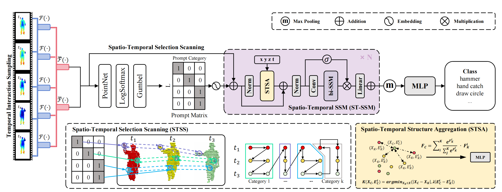

# UST-SSM: Unified Spatio-Temporal State Space Models for Point Cloud Video Modeling 🚀
This repository contains the official PyTorch implementation for the paper: **"UST-SSM: Unified Spatio-Temporal State Space Models for Point Cloud Video Modeling"**, accepted at ICCV 2025.



-----

## 📜 Introduction

Point cloud videos capture dynamic 3D motion while reducing the effects of lighting and viewpoint variations, making them highly effective for recognizing subtle and continuous human actions. Although Selective State Space Models (SSMs) have shown good performance in sequence modeling with linear complexity, the spatio-temporal disorder of point cloud videos hinders their unidirectional modeling when directly unfolding the point cloud video into a 1D sequence through temporally sequential scanning. To address this challenge, we propose the Unified Spatio-Temporal State Space Model (UST-SSM), which extends the latest advancements in SSMs to point cloud videos. Specifically, we introduce Spatial-Temporal Selection Scanning (STSS), which reorganizes unordered points into semantic-aware sequences through prompt-guided clustering, thereby enabling the effective utilization of points that are spatially and temporally distant yet similar within the sequence. For missing 4D geometric and motion details, Spatio-Temporal Structure Aggregation (STSA) aggregates spatio-temporal features and compensates. To improve temporal interaction within the sampled sequence, Temporal Interaction Sampling (TIS) enhances fine-grained temporal dependencies through non-anchor frame utilization and expanded receptive fields. Experimental results on the MSR-Action3D, NTU RGB+D, and Synthia 4D datasets validate the effectiveness of our method.

-----

## 🛠️ Getting Started

### Prerequisites

  * Python 3.8+
  * PyTorch 1.12.0+
  * CUDA 11.3+

### Installation

1.  **Clone the repository:**

2.  **Install Python dependencies:**
    We recommend using a virtual environment (e.g., conda or venv).

    ```bash
    pip install -r requirements.txt
    ```

3.  **Install Mamba and Causal Conv1d:**

    ```bash
    pip install causal-conv1d mamba-ssm
    ```

4.  **Compile custom CUDA layers:**
    Our model relies on custom CUDA operators for PointNet++ and k-Nearest Neighbors (kNN).

      * **PointNet++ Layers:**
        ```bash
        cd modules/
        python setup.py install
        cd ..
        ```
      * **kNN for PyTorch:**
        ```bash
        pip install --upgrade https://github.com/unlimblue/KNN_CUDA/releases/download/0.2/KNN_CUDA-0.2-py3-none-any.whl
        ```

For a detailed environment setup, please refer to the `requirements.yml` file.

-----

## 📊 Datasets

You will need to download and preprocess the datasets before training and evaluation.

### MSR-Action3D

1.  **Download** the dataset from [Google Drive](https://drive.google.com/file/d/1djwAK3oZTAIFbCz531eClxINmsZgGO_H/view?usp=sharing).
2.  Extract the `.zip` file to get `Depth.rar`, and then extract the depth maps.
3.  **Preprocess** the depth maps into point clouds by running the script:
    ```bash
    python scripts/preprocess_file.py --input_dir /path/to/your/Depth --output_dir /path/to/processed_data --num_cpu 11
    ```

### NTU RGB+D

1.  **Download** the dataset from the [official website](https://rose1.ntu.edu.sg/dataset/actionRecognition/). You will need to request access.
2.  After downloading, **convert** the depth maps to point cloud data using our script:
    ```bash
    python scripts/depth2point4ntu120.py --data_path /path/to/your/ntu_dataset
    ```

### Synthia 4D

1.  **Download** the dataset from the [official project page](http://cvgl.stanford.edu/data2/Synthia4D.tar).
2.  Extract the `.tar` file. The data should be ready for use without further preprocessing.

-----

## 🚀 Usage

### Training

To train the UST-SSM model on a dataset, use the following command structure. Make sure to specify the dataset path and the configuration file.

```bash
python train.py --config cfgs/msr-action3d_config.yaml --data_path /path/to/processed_data
```

### Evaluation

To evaluate a trained model, provide the path to your model checkpoint (`.pth` file).

```bash
python test.py --config cfgs/msr-action3d_config.yaml --data_path /path/to/processed_data --checkpoint /path/to/your/model.pth
```

-----

## 🙏 Acknowledgement

This work builds upon the excellent codebase of [PSTNet](https://github.com/hehefan/Point-Spatio-Temporal-Convolution). We thank the authors for making their code publicly available. We are also grateful for the advancements in State Space Models, particularly [Mamba](https://github.com/state-spaces/mamba).

-----

## ✍️ Citation

If you find our work useful for your research, please consider citing our paper:

```bibtex
@inproceedings{li2025ust,
  title={UST-SSM: Unified Spatio-Temporal State Space Models for Point Cloud Video Modeling},
  author={Li, Peiming and Wang, Ziyi and Yuan, Yulin and Liu, Hong and Meng, Xiangming and Yuan, Junsong and Liu, Mengyuan},
  booktitle={Proceedings of the IEEE/CVF International Conference on Computer Vision},
  pages={6738--6747},
  year={2025}
}
```
